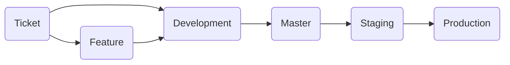

# Yet Another Planning Poker

> YAP Poker aims to be the most flamboyant Planning Poker, also known as a Scrum Poker, in town. Planning poker is a consensus-based, gamified technique for estimating workloads. Join or create a session and invite your Team!

## Installation

### Scripts

To launch application with Webpack run

    yarn start:dev

To build application with Webpack run

    yarn build:dev

## Documentation

### Conventions

#### Commits

The [Commitlint](https://commitlint.js.org/#/) enforces best practices together with [Commitlint Jira rules](https://github.com/Gherciu/commitlint-jira). The commit message issue status must comply with [default Jira statuses](https://confluence.atlassian.com/adminjiracloud/issue-statuses-priorities-and-resolutions-973500867.html) which follow task ID (from Jira board or as running repository prefix and enumeration), task description (as abbreviation), and commit message which must be in present tense. These must all be in capital letters.

Format

    git commit -m "[<ISSUE-STATUS>]<TASK-ID>: [<TASK-DESCRIPTION>] <message>"

As an example

    git commit -m "[CLOSED]TASK-1: [CONF] Create .gitlab-ci.yml production branch CI / CD pipeline

The exception to this are situations when there are merge conflicts which require resolution in main branches (see **Branching Strategy**).

Format

    git commit -m "[RESOLVED]<TASK-ID>: [MERGE] <message>"

As an example

    git commit -m "[RESOLVED]TASK-1: [MERGE] Merge TASK-1 to development"

##### Task descriptions

- [CONF] Informs that the ticket task description concerns configuration
- [FEAT] Informs that the ticket task description concerns feature
- [UPDT] Informs that the ticket task description concerns update to an existing feature / capability
- [FIX] Informs that the ticket task description concerns fix to a particular known issue / bug

_The option to include custom commit rules to include all possible scenarios is up to later consideration_

#### Branching Strategy

##### Overview

There are three main branches — development, staging, and production. These branches contain CI / CD pipeline which builds to corresponding domain / FQDN ex. https://\<branch>.\<domain>.\<domain-extension>

##### Ticket

The ticket branch can branch out from either development branch or feature branch. Once complete the ticket branch merges always back to its parent branch. The only exceptions are unconventional situations where there is requirement to ex. cherry pick a particular commit higher in the tree to patch issues which require immediate attention. The ticket branch name derives from Jira board in use.

##### Feature

The feature branch can branch out only from the development branch. Once complete the feature branch merges always back to its parent branch. The feature branch name has "feature-" prefix which follows brief feature description ex. feature-password-reset.

##### Development

The development branch contains latest code.

##### Master

The master branch must contain at all times ready code ready for release to staging.

##### Staging

The staging branch must contain at all time ready code ready for release to production. Releases to this branch require appropriate version tag as a release candidate postfix and message.

Format

    git tag -a <semver>_rc<number> -m "<message>"

As an example

    git tag -a 1.0.0_rc1 -m "Release 1.0.0~rc1 to staging"

##### Production

The production branch contains latest official release. Releases to this branch require appropriate version tag and message.

Format

    git tag -a <semver> -m "<message>"

As an example

    git tag -a 1.0.0 -m "Release 1.0.0 to production"

#### Versions

The [Semantic Versioning](https://semver.org/) applies.
